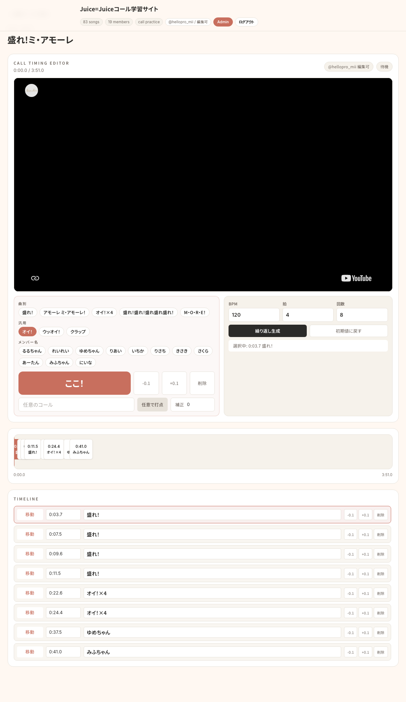
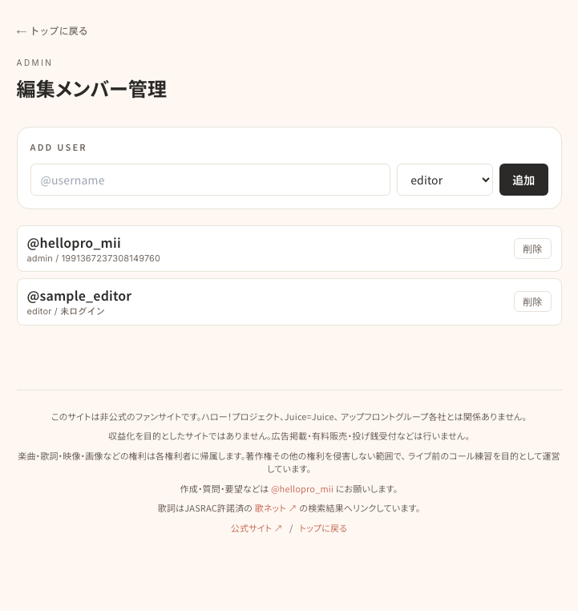
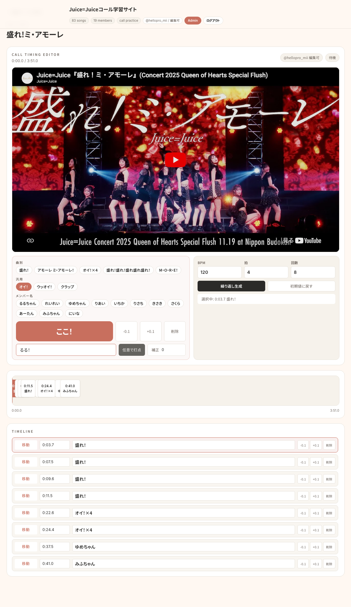
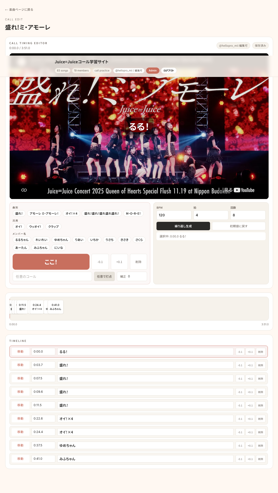
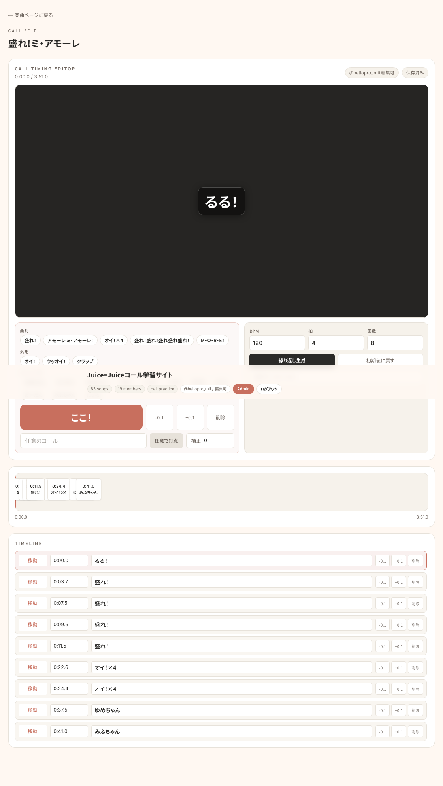

# コール編集マニュアル

このマニュアルは、許可された編集メンバーが `hello-project.jp` 上でコールタイムラインを追加・調整するための手順です。

本番サイトでも同じ内容を公開しています。

- https://hello-project.jp/manual/call-editor/

## 基本ルール

- 編集できるのは、管理者が許可したXアカウントだけです。
- 編集者の追加は、本人が一度XログインしたあとにAdmin画面から承認するのが基本です。
- まずは `ここ！` で大まかに打ち、`TIMELINE` で 0.1秒単位に整えます。
- コールは常時表示ではなく、指定した秒数から短時間だけ動画上に表示されます。
- 迷ったら早めに出すより、実際に声を出す瞬間に近づけます。
- 曲全体がズレている場合は、個別調整の前に全体補正を使います。

## 1. Xでログインする

画面右上の `Xログイン` からログインします。

編集権限があるアカウントでは、ヘッダーや編集画面に `@username / 編集可` と表示されます。`閲覧のみ` と表示される場合は、管理者にXのユーザー名を伝えて編集メンバーに追加してもらってください。

## 2. 編集メンバーを追加する

管理者は `/admin/` から編集メンバーを追加できます。

基本は次の流れです。

1. 編集したい人に先に `Xログイン` してもらう
2. 管理者が `https://hello-project.jp/admin/` を開く
3. `APPROVE LOGGED-IN USERS` に表示されたユーザーを確認する
4. 通常の編集者は `editor`、管理も任せる場合だけ `admin` を押す

まだ本人がログインしていない場合だけ、`ADD USER BY USERNAME` で `@username` を事前登録できます。この場合は `未ログイン仮登録` と表示され、本人の次回Xログイン時にX IDが自動で紐づきます。

権限は通常 `editor` で十分です。編集メンバーの追加・削除も任せる場合だけ `admin` を選びます。

## 3. 「ここ！」で打点を追加する

曲別・汎用・メンバー名から入れたいコールを選び、動画を再生しながらタイミングで `ここ！` を押します。

任意のコールを入れたい場合は入力欄に文言を書き、`任意で打点` を押します。`補正` を `0.1` などにすると、現在位置から少し後ろへずらして登録できます。

## 4. 追加後に確認する

追加したコールは下のバーと `TIMELINE` に反映されます。動画を少し前から再生して、画面中央のオーバーレイ表示が狙ったタイミングで出るか確認します。

保存状態が `保存済み` になればサーバー保存完了です。リロード後も同じ内容が残っていれば問題ありません。

## 5. TIMELINEで微調整・削除する

`TIMELINE` の `移動` で該当秒へ移動できます。秒数欄は `83.2` または `1:23.2` の形式で直接編集できます。

早い場合は `+0.1`、遅い場合は `-0.1` で調整します。不要な行は `削除` で消します。

## 困ったとき

`編集できない`:
Xログインしていない、または許可リストに入っていない可能性があります。先にXログインしたうえで、管理者に承認を依頼してください。

`保存されない`:
ログイン状態が切れている可能性があります。再度Xログインしてから編集してください。

`動画が表示されない`:
ブラウザ拡張やネットワーク制限でYouTube埋め込みがブロックされる場合があります。楽曲ページの `YouTubeで開く` または `YouTube Musicで開く` から直接確認してください。
